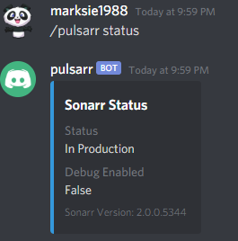
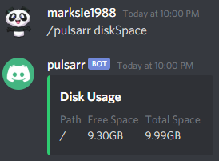

# Arr Commands

Arr Commands are all of the commands that relate to Sonarr or Radarr functions

## search

The search allows you to find a TV Series or a Movie, this can be done via
a search term or TVDB ID

```shell
/pulsarr search show 'the walking dead'
```


```shell
/pulsarr search show 153021
```


## status

This command will show you the status of the Sonarr & Radarr servers:

```shell
/pulsarr status
```



## diskSpace

Shows how much disk space is available on the Sonarr & Radarr volumes:

```shell
/pulsarr diskSpace
```

